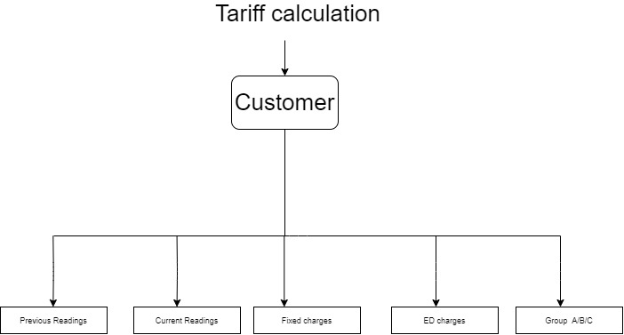

# Tariff Calculation

# Introduction

The amount of money framed by the supplier for the supply of electrical energy to various types of consumers is known as "electrical tariff".The tariff covers the total cost of producing and supplying electrical energy and in addition to reasonable cost.
The actual tariff that the consumer pay depends on the consumption of the eletricity. The industrial consumers pay more tariff because they use more power for long times than the domestic consumers. The electricity tariff depends on the following factors : 1) Type of load, Time at which load is required, The amount of energy used.
The total bill of consumer has these parts namely fixed charge, rate of charge, costumer charge, Electrical duty and no of units consumed.

# Adavantages and Disadvantages of Tariff calculation
# Advantages 

* Less initial cost and we do not need to install metering equipment 
* Poor people will be benefited in flat tariff
* Easy to understand 
* Proper return
* Reasonable profit

# Disadvantages 

* Every consumer have to pay fixed charges irrespective of load variation.

SWOT Analysis :

# WHO : 
Consumers of different types will consume the electricity.

# When : 
It can be used everytime and world is nothing without electrical power.

# Where :
It is used all over the world.

# How : 
From conventional energy sources the energy is converted into useful form of electrical energy and it is generated, transmitted and distributed to consumers. And hence along with the units multiplied with rate of charge,the maintenance nothing but fixed and consumer charges are also added.  

# Low level requirements:

[No of units consumed by the consumer]

High level requirement--- 
Units will be recorded from the
 difference of prev reading and current reading.
|LLR01 |    |select Group |
             |HLR01|     Implemented----
| LLR02 |
The group will be selected like A or B or C 
             | HLR01 |  | Implemented |
| LLR03 | If it not belongs to first group it will be directly switch into other group
             | HLR01|    | Implemented |
| LLR04 | After the selected The rate of charge belongs to that particular group will be multiplied with no. of units to get energy charges.
              | HLR02 |    | Implemented |
| LLR05 | The bill amount will be calculated by adding energy charges to fixed charges, customer charges and electrical duty charges.
| LLR06 |   And hence the total amount will be noted
          |HLR01 HLR02 |  | Implemented |

## Defining Our System

 
 

---

 
